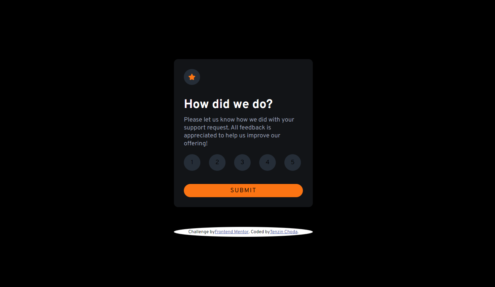
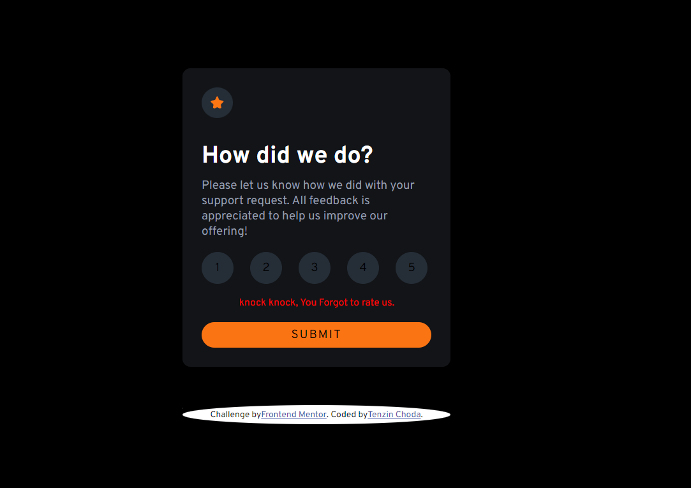
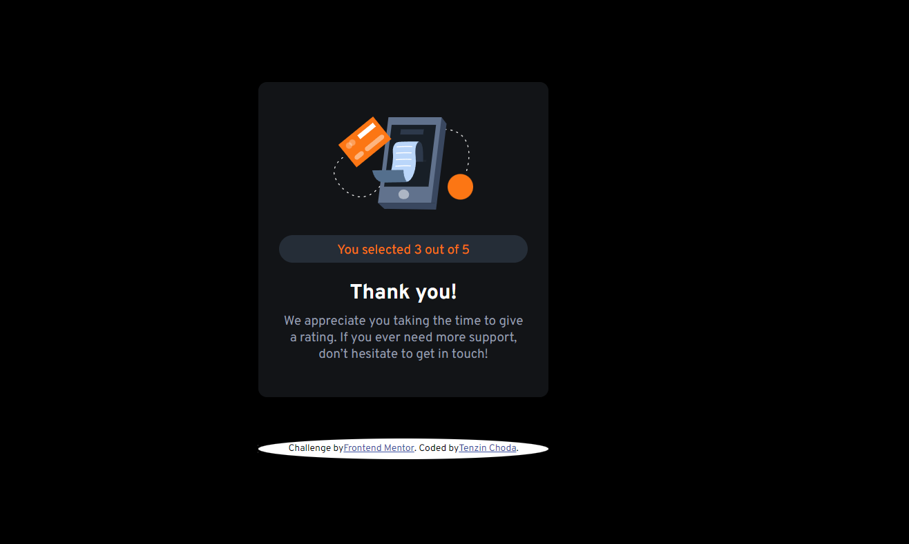
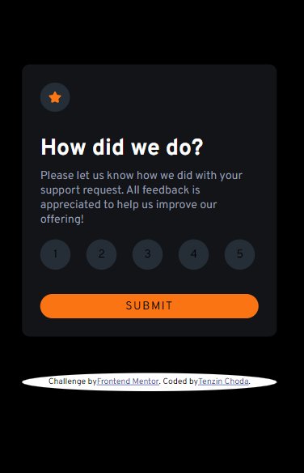

# Frontend Mentor - Interactive rating component solution

This is a solution to the [Interactive rating component challenge on Frontend Mentor](https://www.frontendmentor.io/challenges/interactive-rating-component-koxpeBUmI). Frontend Mentor challenges help you improve your coding skills by building realistic projects. 

## Table of contents

- [Overview](#overview)
  - [The challenge](#the-challenge)
  - [Screenshot](#screenshot)
  - [Links](#links)
- [My process](#my-process)
  - [Built with](#built-with)
  - [What I learned](#what-i-learned)
  - [Continued development](#continued-development)
  - [Useful resources](#useful-resources)
- [Author](#author)
- [Acknowledgments](#acknowledgments)

## Overview
I have designed an interactive rating component where end viewers can rate on a product or service. It also has a thankyou state when the rating is submitted as required by the challenge. As a bonus I have also included a feature to show an error message when the user tries to submit the form without giving a rating.

### The challenge

Users should be able to:

- View the optimal layout for the app depending on their device's screen size
- See hover states for all interactive elements on the page
- Select and submit a number rating
- See the "Thank you" card state after submitting a rating

### Screenshot
# Desktop Design.

# Mobile Design

### Links

- Solution URL: Checkout my solution on *frontend mentor* [here](https://www.frontendmentor.io/solutions/interactive-rating-component-using-css-flexbox-with-error-message-BPduPfYJcT)
- Live Site URL: View the live site [here](https://interactive-rating-component-fem-kappa.vercel.app/)

## My process
I thoroughly went through the design and requirements for this challenge and planned out my steps. setting up the design with HTML and CSS was simple but I had a tough time setting up the functionality with` Javascript` guess I am losing touch with `Javascript`.

### Built with

- Semantic HTML5 markup
- CSS custom properties
- Flexbox
- CSS Grid

### Continued development
After doing this project I realize that I really needed to refresh my `Javascript` knowledge.

## Author
- Frontend Mentor - [@tenze21](https://www.frontendmentor.io/profile/tenze21)
- Twitter - [@TenzinChoe17842](https://www.twitter.com/TenzinChoe17842)

## Acknowledgments
I am really grateful to the Frontend mentor community for the challenge.
